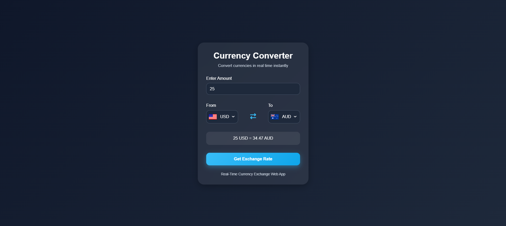

# 💱 Currency Converter Web Application

<div align="center">

A modern and responsive currency converter web application built using **HTML5**, **CSS3**, and **Vanilla JavaScript**.

The application allows users to convert currencies dynamically using real-time exchange rates while providing a clean and user-friendly interface.


</div>

---

## Live Preview

**[View Live Demo]()** 

---

# Overview

This project is a browser-based currency converter application that enables users to convert values between different international currencies using live exchange rate data.

The project was developed to strengthen frontend development concepts including API integration, asynchronous JavaScript, DOM manipulation, responsive UI design, and dynamic data rendering.

---

# Application Preview

<div align="center">
  
  <br/>
  <em>Responsive Currency Converter Interface</em>
</div>

# Features

## Currency Conversion Features

- Real-time currency conversion
- Multiple international currencies supported
- Dynamic exchange rate calculation
- Automatic conversion updates
- Country flag integration
- User-friendly conversion interface

---

## User Interface Features

- Modern and responsive UI
- Clean layout and structured design
- Smooth interaction experience
- Mobile-friendly responsiveness
- Interactive input handling

---

## Technical Features

- API-based exchange rate fetching
- Dynamic DOM manipulation
- Asynchronous JavaScript functionality
- Lightweight frontend architecture
- Beginner-friendly code structure

---

# Tech Stack

| Technology | Purpose |
|------------|---------|
| HTML5 | Structure and semantic layout |
| CSS3 | Styling and responsiveness |
| JavaScript (ES6) | Application logic and API handling |
| Exchange Rate API | Real-time currency data |

---

# Project Structure

```bash
currency-converter-webapp/
│
├── assets/
│   │
│   ├── images/
│   │   ├── default.png
│   │   └── demo.png
│   │
│   └── videos/
│       └── CurrencyConverter Demo Video.mp4
│
├── app.js
├── code.js
├── index.html
├── style.css
└── README.md
```
# Author

## Tushar Mishra

Frontend Web Development Project

# Show Your Support

If you found this project useful or interesting:

- Give this repository a ⭐
- Share feedback
- Suggest improvements


